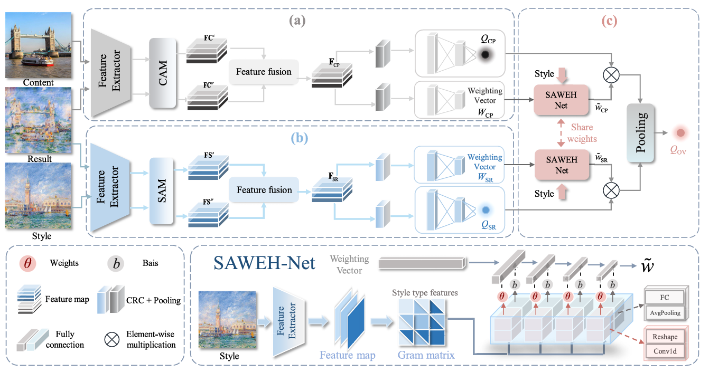
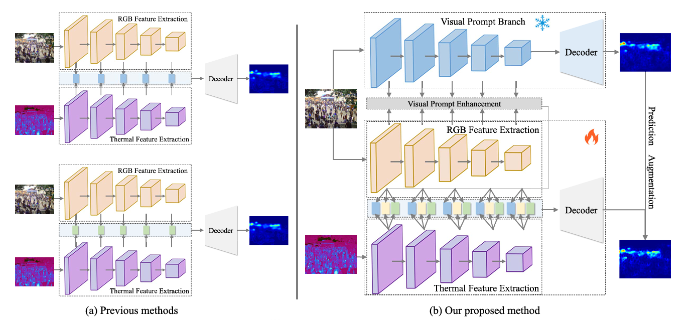
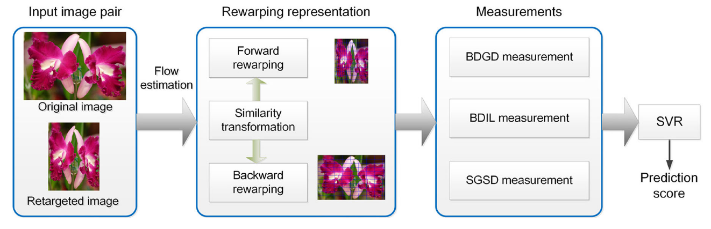
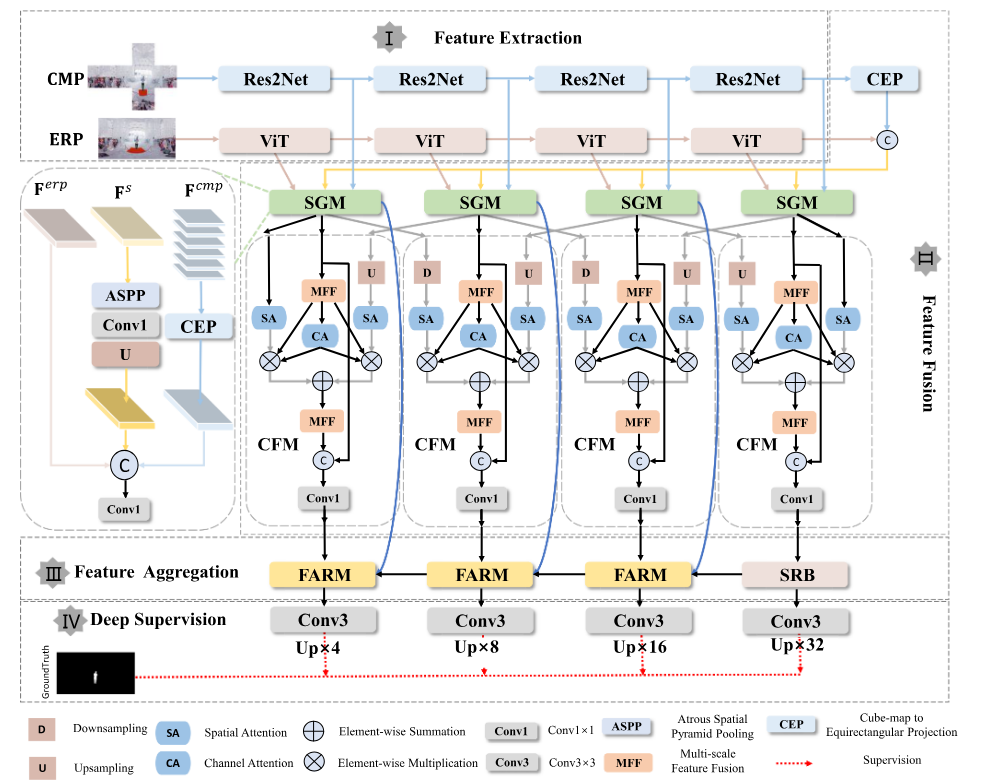
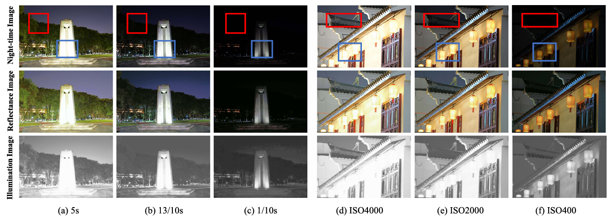
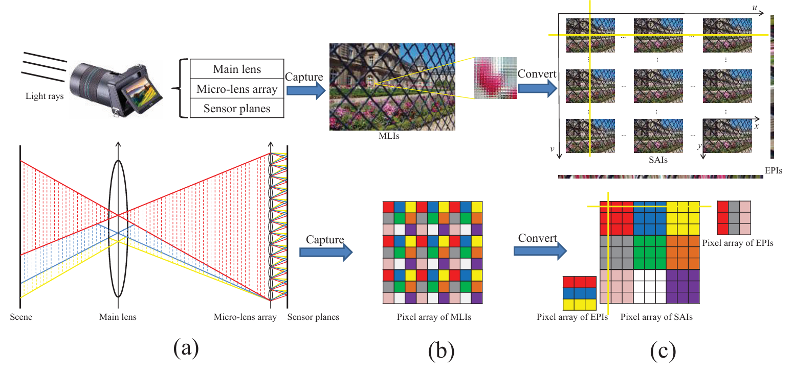
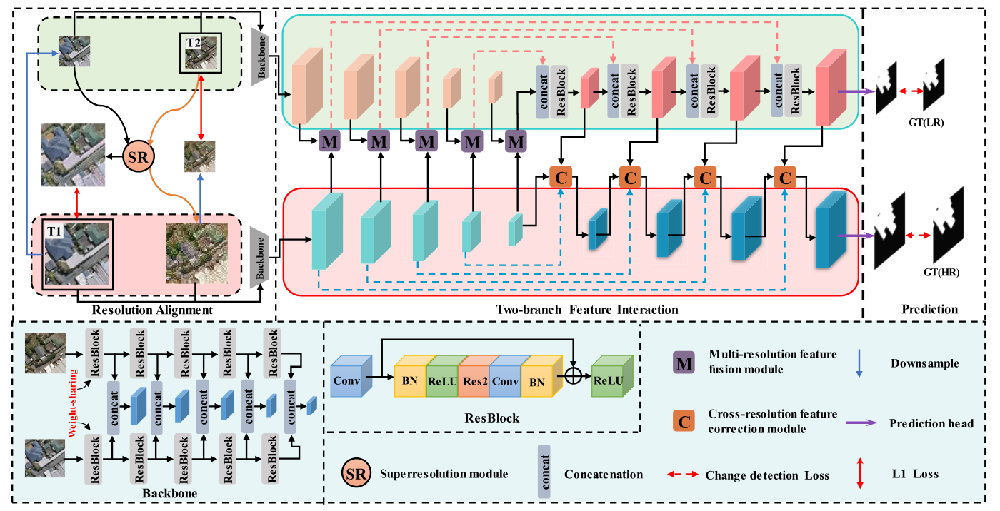
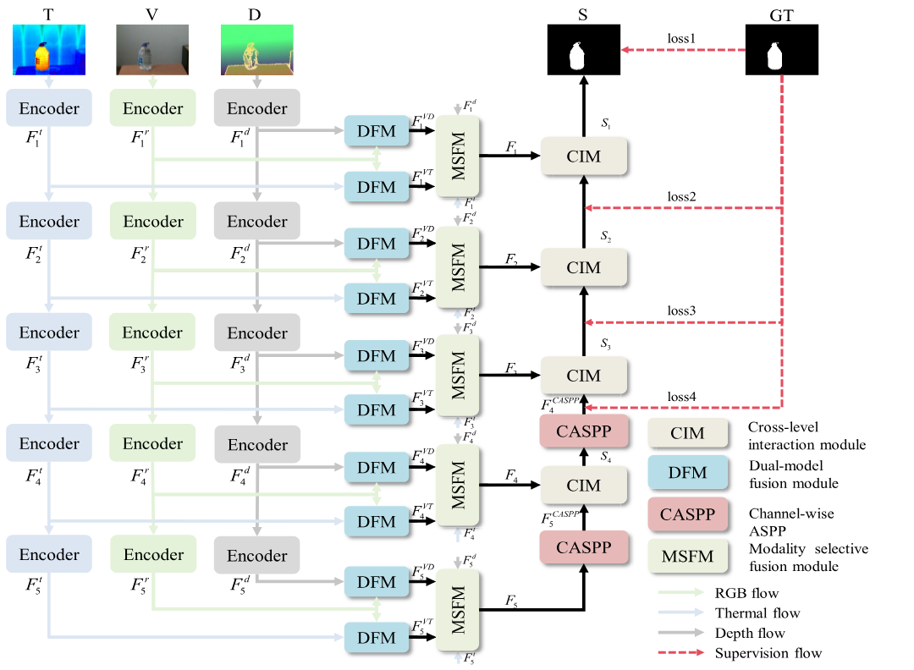
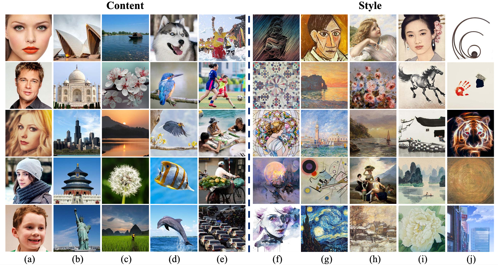
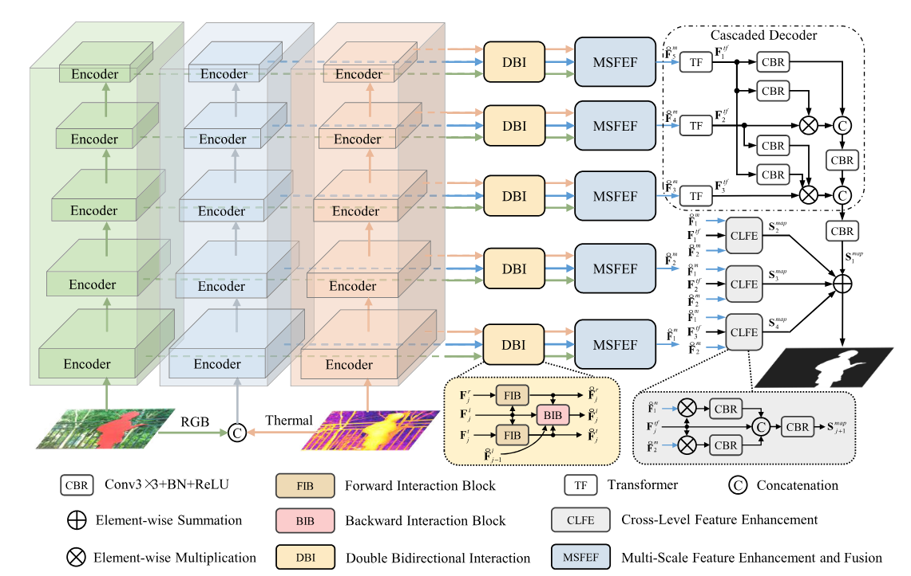








I am Feng Shao. I received the B.S. and Ph.D. degrees in electronic science and technology from Zhejiang University, Hangzhou, China, in 2002 and 2007, respectively. He is currently a Professor with the Faculty of Information Science and Engineering, Ningbo University, China. I am a Visiting Fellow with the School of Computer Engineering, Nanyang Technological University, Singapore, from February 2012 to August 2012, advised by  Prof. <a href = "https://personal.ntu.edu.sg/wslin/Home.html" target = "_blank"> Weisi Lin </a> (IEEE Fellow). The visit was supported by the Chinese Scholarship Council. I published over 100 technical articles in refereed journals and proceedings in the areas of image processing, image quality assessment, and immersive media computing. I received the Excellent Young Scholar Award by NSF of China (NSFC). 

#  Researh Interests 

Imaging Technology
Visual Systems
Machine Intelligence
Artificial Intelligence Applications

 

#  Selected Publications 

<table align="center" border="none">
  <tr>
      <td>
        
      </td>
      <td>
        

        Hangwei Chen, <b>Feng Shao</b>, Xiongli Chai, Qiuping Jiang, Xiangchao Meng, Yo-Sung Ho. Collaborative Learning and Style-Adaptive Pooling Network for Perceptual Evaluation of Arbitrary Style Transfer. IEEE Transactions on Neural Networks and Learning Systems, 35(11): 15387-15401, Nov. 2024.
        <a href="https://ieeexplore.ieee.org/document/10164014">[Paper-Link]</a>
        

      </td>
  </tr>
  <tr>
      <td>
        
      </td>
      <td>
        

        Baoyang Mu, <b>Feng Shao</b>, Zhengxuan Xie, Hangwei Chen, Qiuping Jiang, Xiangchao Meng, Yo-Sung Ho. Visual Prompt Multibranch Fusion Network for RGB-Thermal Crowd Counting, IEEE Internet of Things Journal, 11(19): 31758-31775, Oct. 2024.. 
        <a href="https://ieeexplore.ieee.org/document/10576691">[Paper-Link]</a>
        

      </td>
  </tr>
  <tr>
      <td>
        
      </td>
      <td>
        

        <b>Feng Shao</b>, Zhenqi Fu, Qiuping Jiang, Gangyi Jiang, Yo-Sung Ho. Transformation-Aware Similarity Measurement for Image Retargeting Quality Assessment Via Bidirectional Rewarping, IEEE Transactions on Systems, Man and Cybernetics: Systems, 51(5): 3053-3067, May 2021.
        <a href="https://ieeexplore.ieee.org/document/8736027">[Paper-Link]</a>
        

      </td>
  </tr>
  <tr>
      <td>
        
      </td>
      <td>
        

        Zhentao He, <b>Feng Shao</b>, Gang Chen, Xiongli Chai, Yo-Sung Ho. SCFANet: Semantics and Context Feature Aggregation Network for 360° Salient Object Detection, IEEE Transactions on Multimedia, vol. 26, pp. 2276-2288, Feb. 2024.
        <a href="https://ieeexplore.ieee.org/document/10179183">[Paper-Link]</a>
        

      </td>
  </tr>
  <tr>
      <td>
        
      </td>
      <td>
        

        Jiangli Shi, <b>Feng Shao</b>, Chongzhen Tian, Hangwei Chen, Long Xu, Yo-Sung Ho. Progressive Bidirectional Feature Extraction and Enhancement Network for Quality Evaluation of Night-time Images, IEEE Transactions on Multimedia, vol. 26, pp. 1690-1705, Jan. 2024.
        <a href="https://ieeexplore.ieee.org/abstract/document/10148826">[Paper-Link]</a>
        

      </td>
  </tr>
  <tr>
      <td>
        
      </td>
      <td>
        

       Xiongli Chai, <b>Feng Shao</b>, Qiuping Jiang, Xuejin Wang, Long Xu, Yo-Sung Ho. Blind Quality Evaluator of Light Field Images by Group-Based Representations and Multiple Plane-Oriented Perceptual Characteristics, IEEE Transactions on Multimedia, vol. 26, pp. 607-622, Jan. 2024. 
        <a href="https://ieeexplore.ieee.org/document/10105489/">[Paper-Link]</a>
        

      </td>
  </tr>
  <tr>
      <td>
        
      </td>
      <td>
        

        Jinghui Li, <b>Feng Shao</b>, Xiangchao Meng, and Zhiwei Yang. Dual-Branch Cross-Resolution Interaction Learning Network for Change Detection at Different Resolutions, IEEE Transactions on Geoscience and Remote Sensing, vol. 63, article no. 4600116, Jan. 2025.
        <a href="ieeexplore.ieee.org/abstract/document/10816435/">[Paper-Link]</a>
        

      </td>
  </tr>
  <tr>
      <td>
        
      </td>
      <td>
        

        Yi Luo, <b>Feng Shao</b>, Baoyang Mu, Hangwei Chen, Zhuo Li, Qiuping Jiang. Dynamic Weighted Fusion and Progressive Refinement Network for Visible-Depth-Thermal Salient Object Detection, IEEE Transactions on Circuits and Systems for Video Technology, vol. 34, no. 11, pp. 10662-10677, Nov. 2024.
        <a href="https://ieeexplore.ieee.org/abstract/document/10556617/">[Paper-Link]</a>
        

      </td>
  </tr>
   <tr>
      <td>
        
      </td>
      <td>
        

       Hangwei Chen, <b>Feng Shao</b>, Xiongli Chai, Yuese Gu, Qiuping Jiang, Xiangchao Meng, Yo-Sung Ho. Quality Evaluation of Arbitrary Style Transfer: Subjective Study and Objective Metric, IEEE Transactions on Circuits and Systems for Video Technology, 33(7): 3055-3070, July 2023. 
        <a href="https://ieeexplore.ieee.org/document/9994780">[Paper-Link]</a>
        

      </td>
  </tr>
   <tr>
      <td>
        
      </td>
      <td>
        

        Zhengxuan Xie, <b>Feng Shao</b>, Gang Chen, Hangwei Chen, Qiuping Jiang, Xiangchao Meng, Yo-Sung Ho. Cross-Modality Double Bidirectional Interaction and Fusion Network for RGB-T Salient Object Detection, IEEE Transactions on Circuits and Systems for Video Technology, 33(8): 4149-4163, Aug. 2023. 
        <a href="https://ieeexplore.ieee.org/document/10032588/">[Paper-Link]</a>
        

      </td>
  </tr>
  <tr>
</table>

For more papers, please kindly refer to [my Google Scholar page](https://scholar.google.com/citations?hl=zh-CN&user=n0xnWAoAAAAJ).

#  Research Projects: 
+ **Hosted over 10 scientific research projects with a total research budget exceeding 5 million RMB, some of which are as follows:**
  - 2025–2028, PI, Research on Multi-source Visual Data Collaborative Representation and Evaluation Methods for Human–Machine Hybrid Task Requirements, National Natural Science Foundation of China (General Program, Grant No.62471263), ¥510,000, Ongoing
  - 2021–2024, PI, Research on Stereoscopic Panoramic Video Quality Assessment and Enhancement for User Visual Experience, National Natural Science Foundation of China (General Program, Grant No.62071261), ¥540,000, Completed
  - 2017–2019, PI, 3D Video Signal Processing and Evaluation, National Science Fund for Excellent Young Scholars (Grant No.61622109), ¥1,500,000, Completed
  - 2013–2016, PI, 3D Video Quality Assessment Based on Visual Quality and Visual Comfort, National Natural Science Foundation of China (Youth Fund and General Program Continuous Support, Grant No.61271021), ¥800,000, Completed
  - 2010–2012, PI, Joint Coding of Multi-view Video and Depth for FTV View Synthesis, National Natural Science Foundation of China (Youth Fund, Grant No.60902096), ¥220,000, Completed
  - 2018–2021, PI, Modeling of Multimodal 3D Visual Comfort and Its Applications in Assessment and Enhancement, Zhejiang Provincial Natural Science Foundation (Distinguished Youth Project, Grant No.LR18F010002), ¥500,000, Completed
  - 2024–2026, PI (1/18), Collaborative Representation, Coding, and Evaluation Technologies for Multi-source Visual Data under Ubiquitous Adversarial Environments, Ningbo “Innovation Yongjiang 2035” Key Technology Breakthrough Program (Grant No.2024Z113), ¥1,000,000, Ongoing
  - 2022–2025, PI, Wide Field-of-View Image Perception Assessment and Intelligent Enhancement for Omnidirectional Vision, Ningbo Natural Science Foundation (Key Project, Grant No.2022J067), ¥300,000, Ongoing
  - 2025–2026, PI, Research on Key Technologies for Safety Risk Perception and Early Warning in Tobacco Industrial Parks, Zhejiang China Tobacco Industry Co., Ltd., ¥1,400,000, Ongoing
  - 2025–2026, PI, Development of Industrial Intelligent Control Domain-Specific Large Model Applications, Digital Ningbo Technology Co., Ltd., ¥700,000, Ongoing

#  Academic Service 
+ **Reviewer for Journals:**
  - IEEE Transactions on Pattern Analysis and Machine Intelligence (TPAMI)
  - IEEE Transactions on Image Processing (TIP)
  - IEEE Transactions on Visualization and Computer Graphics (TVCG)
  - IEEE Transactions on Neural Networks and Learning Systems (TNNLS)
  - IEEE Transactions on Circuits Systems for Video Technology (TCSVT)
  - IEEE Transactions on Multimedia (TMM)
